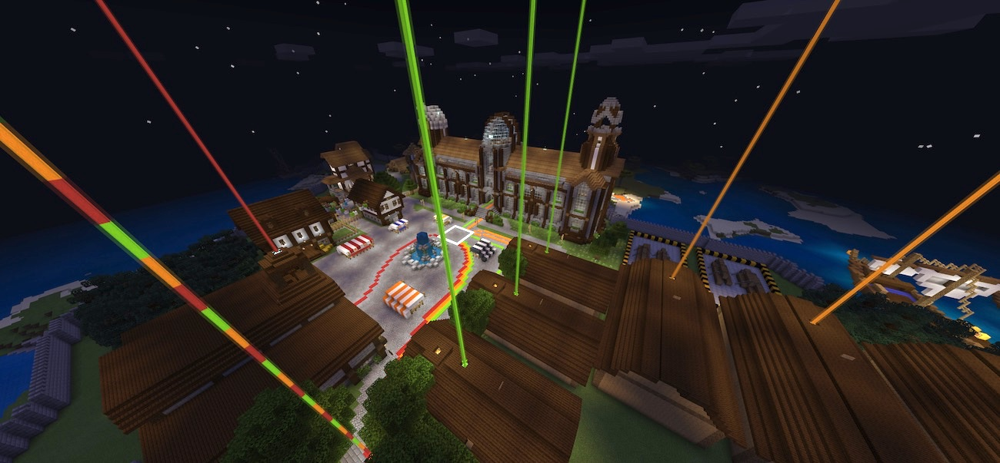

# Seymour Island

This repository contains the behaviour pack for the Seymour Island Minecraft Education Edition lesson.   
Seymour Island is a multiplayer coding adventure, which takes up to 30 students, through a series of 8 unique coding tasks together.   
It can be downloaded from the [Minecraft Education Edition content library](https://education.minecraft.net/lessons/seymour-island).   
